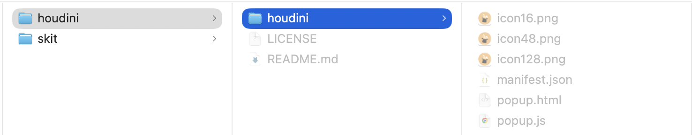
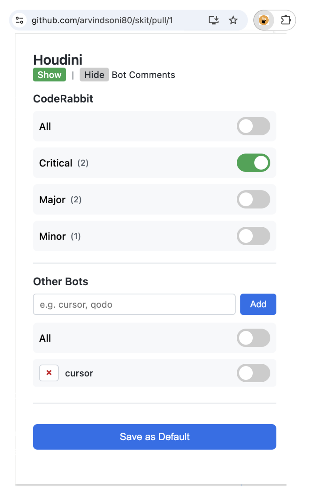

# houdini
Houdini is a chrome extension to show or hide comments from CodeRabbit and other bots in your GitHub pull request (PR). For CodeRabbit comments you can show or hide all comments or by severity levels. For other bots, you add the name of the bot and then you can show or hide all comments. 

The visibility settings can be saved as default to apply on any PR page. When you change the settings for a specific PR tab, that setting is remembered till the tab is open. 

Houdini works by local manipulation of content in your browser page. It doesn't connect with any service or server in the backend. 

> Note: Houdini is experimental and not an officially supported Chrome Extension. Please read the license terms before using.

## Install

```bash
git clone git@github.com:arvindsoni80/houdini.git
```

In Chrome Browser,

* Open a tab and enter `chrome://extensions/`
* Turn on the `Developer mode` (toggle is on the top right corner)
* Click `Load unpacked`
* Browse and select the `houdini` directory inside the houdini repo you cloned. 
* If you want you can `pin` the extension for easy access.



## Usage

* On a GitHub PR page which has CodeRabbit and/or other bot comments, click on the Houdini extension. 
* Toggle the various visibility filters and you should see the comments show/hide. For example, if you have CodeRabbit comments, the `All Hide` will hide all the comments. 
* If you have other bots, add the name of the bot and toggle the visibility. For example, if you have `foo` bot comments, add `foo` in the `Other Bots` section and toggle its visibility to show/hide the comments.
* You save the settings as default and that will apply to all PR pages when they are open.


